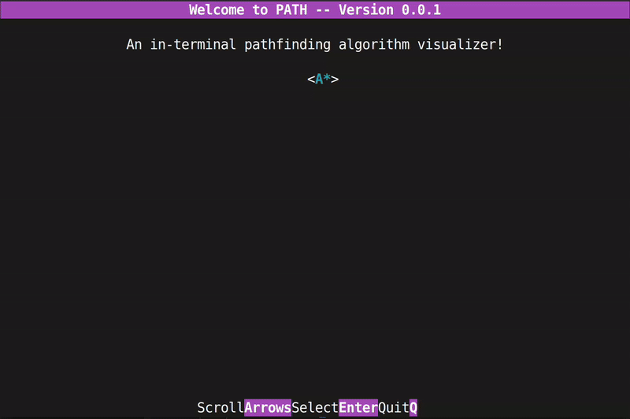

# WELCOME TO PATH
A dynamic in-terminal pathfinding algorithm visualiser written in C. Demo below uses A* algorithm.




If you would like the algorithm to run faster or slower you can change the `DRAW_DELAY_MICRO_SEC` macro in cell.h. Anything between 3000-8000 I've found to look best. Does depend on this algorithm though, for A* use something higher as there won't be as many cells searched.


# Build

As of right now only Linux is supported due to the termios library.

Clone the repository using:
```console
git clone https://github.com/olly-evans/terminal-pathfinding
```

Change into the new directory using:

```console 
cd foldername
```

Use make to build the project:

```console 
make run
```

Or alternatively just:
```console 
make
```

Make command alone will compile without running afterwards, the executable can then be found in the /bin/ folder and ran manually using:

```console
./bin/main
```

# Usage

After running you will see the main menu where you can select an algorithm using the arrow keys and then pressing enter.

This will then take you to the main visualisation.

Visualisation key controls:

- ArrowKeys: Move the cursor.
- Space: Place the start, end and barriers at cursors position manually.
- H: Randomize the grid and start/end points.
- C: Clear/reset the grid.
- Enter: Start the chosen algorithm (S and E must be placed.)
- Q: Quit.

This is a more verbose explanation of the key controls in the visualiser. The cursor can be moved using the arrow keys. The start (S) and end cell (E) can be chosen using the space bar when the cursor is in the wanted position. These are the cells that the chosen algorithm will start at and then try to find a path to. Once the start and end are placed barriers (white) can be inserted to obstruct the algorithm also using the space bar, the algorithm cannot use these barriers in its search. Or alternatively the grid can be assigned randomly using the H key.

Once you are happy with the layout you have created for the algorithm you can press enter and the algorithm will find a path. Whether this is the shortest path or not depends on the algorithm selected, see the algorithms section below for more info.

Pink represents cells that have been considered by the algorithm whereas blue ones are cells that it is considering.

# Algorithms 

## A*
A* finds the shortest path with respect for given weights with a start and end node. I used a binary min-heap to most efficiently store the open set of nodes. 

## Breadth-First Search
Breadth-first search starts at the tree root and explores all nodes at the present depth prior to moving on to the nodes at the next depth level. A queue was needed to keep track of the child nodes that were encountered but not yet explored. 

## Depth-First Search
DFS starts at the root node (selecting some arbitrary node as the root node in the case of a graph) and explores as far as possible along each branch before backtracking. A stack was needed to keep track of the nodes discovered so far along a specified branch which helps in backtracking of the graph. 

Whilst being a much more maze-oriented algorithm its still fun to watch it explore.

# TODO
- Vertical padding for menu. Abort if screenrows less than appropriate no.
- Fix DFS logic where occasionally it won't fully explore to depth.
- Make dfs more random with selection.
- Controls in main visualisation.
- 
- Support for random placement after runtime.